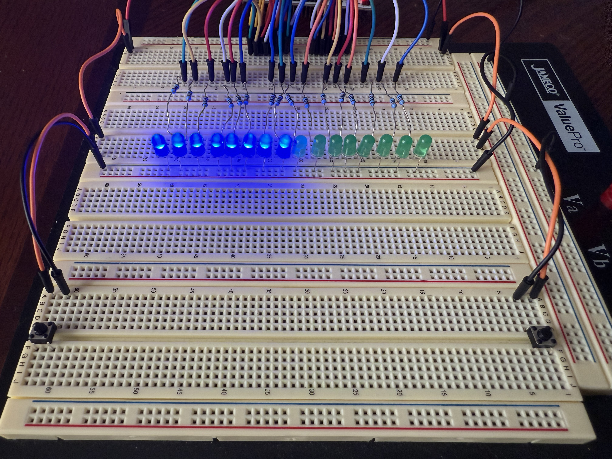
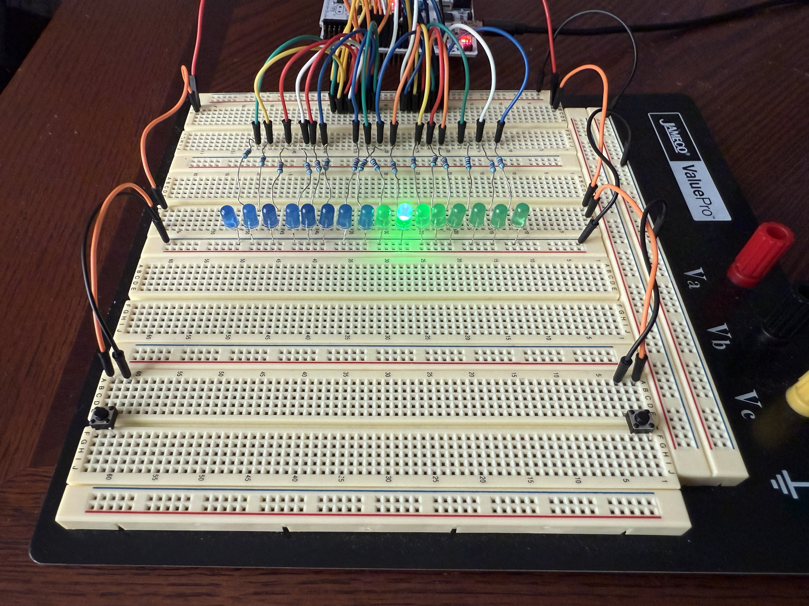

# LED PhaseShifter  

A real-time LED control project for the **STM32L476RG**, using interrupts, SysTick, and GPIO to control 16 external LEDs. Includes two operation modes: **Flash Mode** for automatic LED animation, and **Move Mode** for manual LED shifting using button inputs.

---

## 🎥 Demos
<table>
  <tr>
    <td>
      
    </td>
    <td>
      
    </td>
  </tr>
  <tr>
    <td><strong>Flash Mode Demo</strong></td>
    <td><strong>Mode Switching & Move Mode Demo</strong></td>
  </tr>
</table>

---

## ⚙️ Features

🔄 **Dual Operating Modes**  
- **Flash Mode** – LEDs flash in an alternating left/right pattern with adjustable frequency (1 Hz to 16 Hz).  
- **Move Mode** – Manually shift a single LED left or right based on button input.

⚡ **User-Driven Controls**  
- In **Flash Mode**:  
  - Left button: Halves the flash frequency  
  - Right button: Doubles the flash frequency  
- In **Move Mode**:  
  - Left button: Shifts LED one position to the left  
  - Right button: Shifts LED one position to the right  

🔁 **Instant Mode Switching**  
- Pressing the built-in **USER button** instantly toggles between Flash Mode and Move Mode.

🕒 **Precise Timing and Control**  
- **TIM2**: Controls LED animation timing  
- **SysTick**: Used for millisecond-level timing and software debouncing  

👆 **Interrupt-Based Input Handling**  
- External interrupts configured on **PA1**, **PA4**, and **PC13**  
- Software-based debouncing ensures reliable button input  

🧪 **Bare-Metal Embedded C**  
- No HAL (Hardware Abstraction Layer); relies on direct register access using **CMSIS**

---

## 🔌 Hardware Requirements

- **STM32 NUCLEO-L476RG** development board  
- **16 external LEDs**  
  - 8 LEDs for **Side A**  
  - 8 LEDs for **Side B**  
- **16 current-limiting resistors** (220Ω–470Ω, one per LED)  
- **2 external pushbuttons**  
  - Connected to **PA4** (left) and **PA1** (right)  
  - Internally pulled-up  
- **Built-in USER button** (PC13)  
- Breadboard and jumper wires  
- USB cable for power and programming via ST-Link

